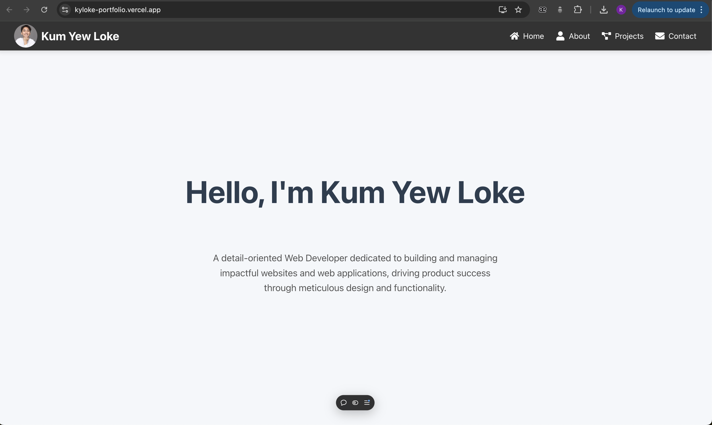

# Kum Yew Loke - Personal Portfolio Website

[](https://kyloke-portfolio.vercel.app/)
[](https://nextjs.org/)
[](https://opensource.org/licenses/MIT)

A fully responsive, SEO-optimized personal portfolio built with Next.js, TypeScript, and Tailwind CSS. This project showcases my skills, features my work, and provides a clear point of contact for freelance opportunities.

**[](https://kyloke-portfolio.vercel.app/)**

---

## 🌟 Project Overview

This portfolio was strategically migrated from a standard client-side rendered (CSR) **Create React App** to a modern **Next.js** application. The primary motivation for this architectural overhaul was to significantly improve **SEO**, **performance (Core Web Vitals)**, and the overall **developer experience**.

The result is a fast, discoverable, and easily maintainable website that serves as a powerful tool for my freelance business.

## ✨ Key Features

- **Static Site Generation (SSG):** Blazing-fast page loads and optimal SEO by serving pre-rendered HTML.
- **Advanced Animations:** Fluid page transitions and scroll-triggered animations powered by **Framer Motion**.
- **Type-Safe Codebase:** Built entirely with **TypeScript** for robust, error-free development.
- **Responsive Design:** A mobile-first approach using **Tailwind CSS** ensures a seamless experience on all devices.
- **Optimized Images:** Automatic image optimization, lazy loading, and modern format conversion using `next/image`.
- **Functional Contact Form:** A secure contact form that sends emails via a **Next.js API Route**, protecting credentials and providing a serverless backend.
- **Component-Based Architecture:** A clean and scalable structure with reusable UI elements and page sections.

## 🛠️ Tech Stack

| Technology      | Description                               |
| --------------- | ----------------------------------------- |
| **Next.js**     | React framework for SSG, SSR, and routing |
| **React**       | UI library for building components        |
| **TypeScript**  | Static typing for JavaScript              |
| **Tailwind CSS**| Utility-first CSS framework for styling   |
| **Framer Motion**| Animation library for React               |
| **Resend / Formspree** | Email delivery service for contact form |
| **ESLint**      | Code linting and quality assurance        |
| **Vercel**      | Hosting and serverless functions          |

## 🚀 Getting Started

To run this project locally, follow these steps:

1.  **Clone the repository**
    ```bash
    git clone https://github.com/auan369/my-portfolio.git
    cd my-portfolio
    ```

2.  **Install dependencies**
    ```bash
    npm install
    ```

3.  **Set up environment variables**
    Create a `.env.local` file in the root of the project and add the necessary variables for the contact form.
    ```env
    # For the contact form (using Resend as an example)
    RESEND_API_KEY=your_secret_api_key
    EMAIL_TO_SEND_TO=your.email@example.com
    ```

4.  **Run the development server**
    ```bash
    npm run dev
    ```
    Open [http://localhost:3000](http://localhost:3000) in your browser to see the result.

## 🏗️ Architectural Decisions & Learnings

This project was a deep dive into modern web architecture. Here are some key decisions I made:

- **Why Next.js over CRA?**
  I chose to migrate to Next.js primarily for its out-of-the-box SEO capabilities. Pre-rendering pages as static HTML makes the site instantly crawlable by search engines and dramatically improves the First Contentful Paint (FCP) and Largest Contentful Paint (LCP) scores.

- **Component Structure:**
  I broke down pages into two types of components:
  1.  `components/sections`: Large, self-contained blocks that make up a page (e.g., `HeroSection`, `PortfolioSection`).
  2.  `components/ui`: Small, reusable UI elements used across the site (e.g., `SkillPill`, `Socials`).

- **The `<PageWrapper>` Layout Pattern:**
  To handle page-specific backgrounds while maintaining consistent content padding, I created a `<PageWrapper>` component. This layout component applies the necessary padding and max-width constraints, allowing the parent `<section>` tag to have a "full-bleed" background. This is a clean, reusable solution for a common layout challenge.

- **Backend with API Routes:**
  Instead of relying on a client-side mailto link, I built a Next.js API Route to handle the contact form. This allows for server-side validation and securely uses an email service provider's API key without exposing it in the browser.

## 🌐 Deployment

This site is deployed on **Vercel**. The Vercel platform is deeply integrated with Next.js, providing a seamless deployment experience. Every push to the `main` branch automatically triggers a new production build and deployment.

---
Designed and developed by Kum Yew Loke.